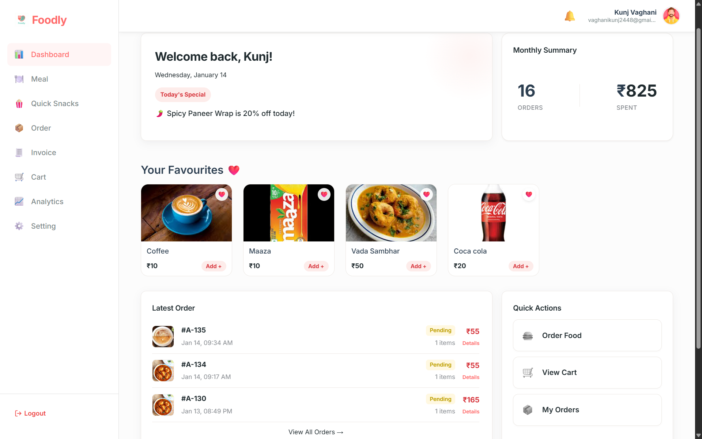
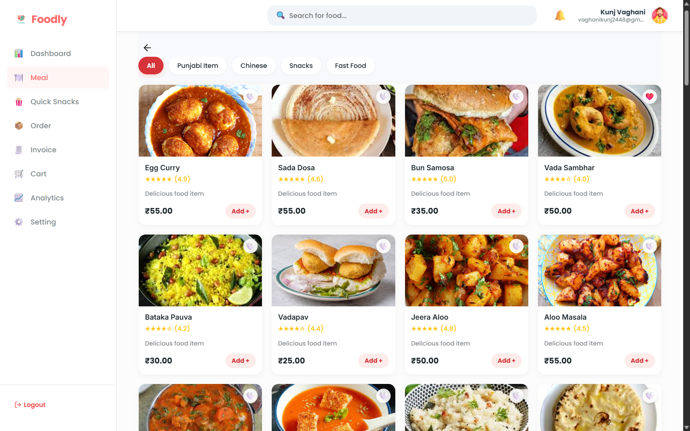
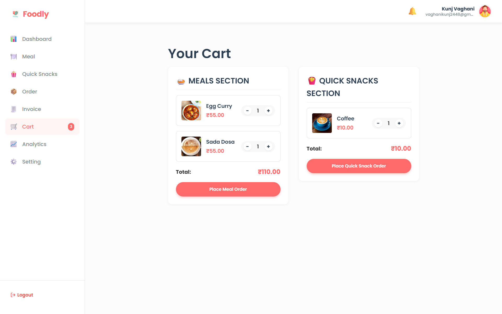
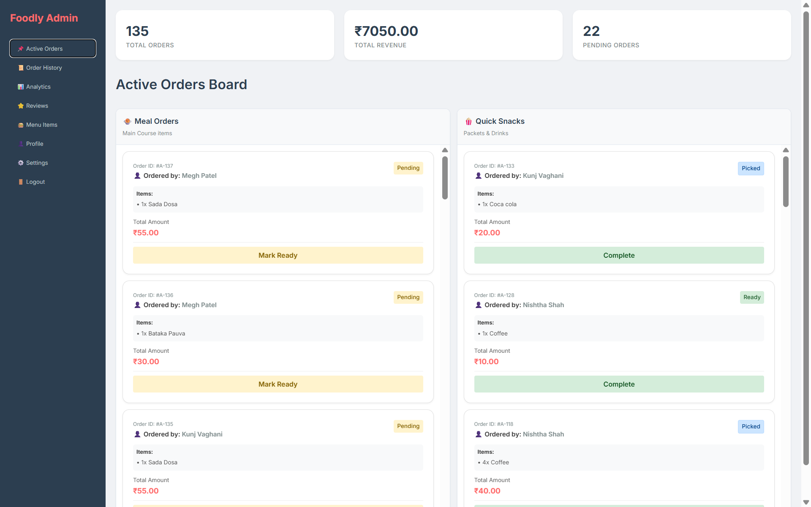
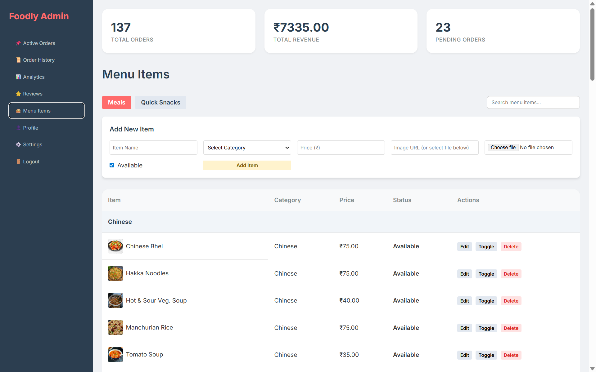
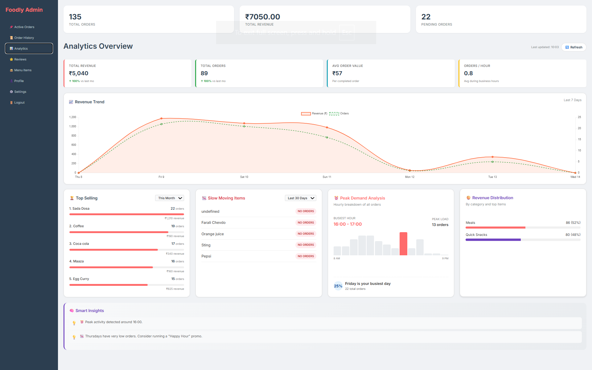

# 🍔 Foodly — Smart Campus Food Ordering & Operations Platform


> **Order Smart. Eat Fast. Zero Queues.**  
A full-stack smart campus food ordering platform that enables real-time ordering, live order tracking, admin operations, feedback analytics, and scalable cloud integration using Firebase.

🏆 **Top 10 Finalist — Hackathon Project**

---

## 📌 Overview

**Foodly** is a digital canteen platform designed for colleges and campuses to eliminate physical queues, reduce operational inefficiencies, and provide data-driven insights for food management.

Students can browse the menu, place orders, track live order status, and submit feedback.  
Admins can manage menu availability, monitor real-time orders, generate invoices, analyze demand trends, and trigger notifications automatically.

The platform is currently deployed as a **Web App** and is evolving into a **Native Android App (Kotlin + Jetpack Compose)** with future AI-based analytics.

---

## 🌟 Why Foodly Exists (Problem Statement)

In most college campuses:

- ❌ Students waste time standing in food queues  
- ❌ Canteen staff manually manage orders → mistakes happen  
- ❌ No real-time order tracking  
- ❌ No structured feedback system  
- ❌ No data-driven insights for demand planning  
- ❌ Peak-hour chaos leads to poor experience  


---

## ✅ Solution

Foodly solves this by introducing::

✔️ Online food ordering system  
✔️ Real-time order synchronization  
✔️ Admin dashboard for operations  
✔️ Chip-based rating & feedback system  
✔️ Invoice management  
✔️ Firebase Cloud Messaging notifications  
✔️ Analytics dashboards  
✔️ Scalable cloud backend  
✔️ Future AI prediction models  

---


## 🎯 What Makes Foodly Special

### 🚀 Smart Ordering System
- Students browse menu digitally
- Place orders instantly
- Receive order ID and status updates
- No physical queue needed

### 🧑‍🍳 Admin / Canteen Dashboard
- View incoming orders in real-time
- Mark orders as **Preparing** and **Ready**
- Manage food items (availability / sold-out)
- Track order flow efficiently

### 🔔 Real-Time Notifications
- Firebase Cloud Messaging notifies users when food is ready
- Reduces crowding and waiting confusion

### ⭐ Intelligent Feedback System
- Chip-based rating system instead of traditional stars
- Feedback visible to all users for better decision making
- Feedback linked to completed orders only
- Improves food quality transparency

### 📊 Analytics Ready
- Integrated Google Analytics
- Tracks user behavior, popular items, peak hours
- Future-ready for ML prediction models

### 📱 Native Android App (In Progress)
- Kotlin + Jetpack Compose
- Direct mobile experience
- Eliminates WebView dependency
- Production-ready roadmap

---

## 🧑‍🎓 User Features

- 📱 Browse dynamic menu  
- 🛒 Add items to cart  
- 💳 Place orders  
- ⏱️ Track order status in real time  
- 🔔 Receive order-ready notifications  
- ⭐ Rate items using chip feedback  
- 👥 View shared feedback from other users  
- 🧾 View order history and invoices  

---

## 🧑‍🍳 Admin Features

- 📊 Admin dashboard overview  
- 📥 Live order monitoring  
- 🧾 Invoice generation  
- 🥗 Add / edit menu items  
- 🔄 Manage item availability  
- ✅ Mark orders ready  
- 📈 Analytics & reporting  
- 🔔 Notification trigger control  


---

## 🏗️ Tech Stack

### 🌐 Frontend


### ☁️ Backend & Cloud


### 🧰 Tools


---
## 🏗️ System Architecture

Foodly follows a **Serverless Web Application Architecture** built on Firebase services with client-side JavaScript-based notifications.

---

### 🌐 Presentation Layer (Client)
- HTML5, CSS3, Vanilla JavaScript  
- Firebase Web SDK  
- Hosted on Firebase Hosting  
- Handles UI rendering, authentication flow, order placement, real-time listeners, image upload/display, and in-page notifications  

---

### ☁️ Backend Layer (Serverless)
- Firebase Cloud Functions (Node.js)  
- Firebase Admin SDK  
- Handles secure backend logic such as order processing, invoice generation, validation, and automation  

---

### 🗄️ Data Layer (Managed Services)
- 🔐 Firebase Authentication — User identity & access control  
- 📦 Firestore Database — Orders, menu items, users, feedback  
- 🖼 Firebase Storage — Food images and assets  
- 📊 Google Analytics (optional) — Usage tracking  

---
### 🔁 Data Flow
```text
User Browser
   |
   |  (HTML / CSS / JavaScript)
   v
Firebase Hosting (Static Web App)
   |
   |  Firebase Web SDK
   v
Firebase Authentication
   |
   v
Firestore Database  <---->  Firebase Storage
   |
   v
Cloud Functions (Node.js)
   |
   v
Client-side JavaScript Notifications
```


---

### ✅ Architecture Benefits
- Fully serverless and auto-scalable  
- Real-time data synchronization  
- No backend server maintenance  
- Secure authentication and storage rules  
- Lightweight client-side notifications  
- Cost-efficient cloud infrastructure  
- Production-ready deployment  
---
## ⚙️ Installation & Setup

### ✅ Prerequisites
- Node.js installed
- Firebase CLI installed
- VS Code (recommended)

---

### 🔹 Install Firebase CLI
```bash
npm install -g firebase-tools
firebase login
```

---

### 🔹 Install Project Dependencies
```bash
npm install
```

(Uses package.json dependencies)

---

### 🔹 Run Locally
```bash
firebase serve
```

or open `templates/index.html` using Live Server.

---

## 📂 Project Structure

```
Foodly-main/
│
├── firebase.json
├── package.json
├── package-lock.json
├── README.md
├── .gitignore
│
├── css/
│   └── style.css
│
├── images/
│   ├── active_order.png        
│   ├── analytics.png           
│   ├── cart.png                
│   ├── chip-rating.png         
│   ├── logo.png                
│   ├── Menu_items.png          
│   ├── menu.png                
│   └── user_dashboard.png      
│
├── js/
│   ├── firebase.js
│   ├── auth.js
│   ├── admin_dashboard.js
│   ├── user_dashboard.js
│   ├── analytics.js
│   ├── orders.js
│   └── user_analytics.js
│
├── templates/
│   ├── index.html
│   ├── profile.html
│   ├── admin.html
│   ├── dashboard.html
│   ├── menu.html
│   ├── orders.html
│   ├── cart.html
│   ├── analytics.html
│   ├── invoices.html
│   ├── settings.html
│   └── 404.html
│    
└── report/
    └── analysis_report.md
```

---

## 🚀 Future Enhancements

- 🤖 AI demand prediction  
- 🍽️ Personalized recommendations  
- 📊 Advanced analytics dashboards  
- 📱 Full Android app deployment  
- 💳 Online payment integration  
- 🧾 Automated billing  
- 🏫 Multi-campus support  
- 📦 Inventory optimization  

---

## 🧪 MVP Highlights

- Real-time ordering flow  
- Admin operational control  
- Firebase live sync  
- Chip-based rating system  
- Notification pipeline  
- Analytics reports  
- Hackathon demo ready  

---

## ⚡ Key Engineering Highlights

- ✔ Real-time database synchronization  
- ✔ Modular frontend structure  
- ✔ Scalable cloud architecture  
- ✔ Secure authentication flow  
- ✔ Optimized deployment workflow  
- ✔ Mobile-first future architecture  
- ✔ Analytics-driven mindset  
- ✔ Hackathon validated solution  

---

## 🏆 Achievements

- 🥇 Top 10 Finalist – Hackathon Project  
- 🚀 Built complete end-to-end system  
- 📱 Android app under active development  
- 📊 Data analytics integration completed  
- 💡 Real-world campus impact potential  

---

## 📸 Screenshots

### 🏠 User Dashboard


### 📋 Menu View


### 🛒 Cart Page


### 🧑‍🍳 Admin Dashboard


### ➕ Add Menu Items (Admin)


### 📊 Admin Analytics Dashboard


---

## ⭐ Support

If you find this project useful:

⭐ Star this repository  
🍴 Fork and explore  
💬 Share feedback  

---

> Built with ❤️ for smart campuses and scalable digital systems
